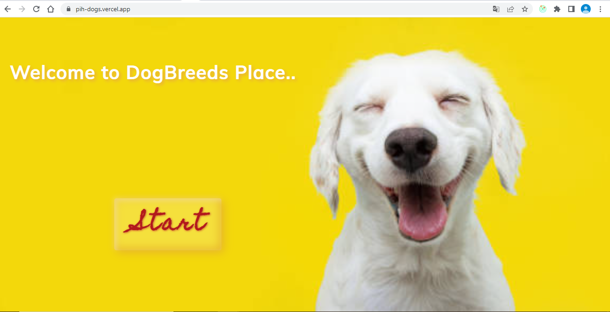
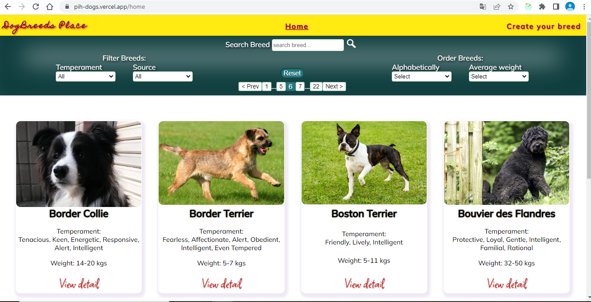
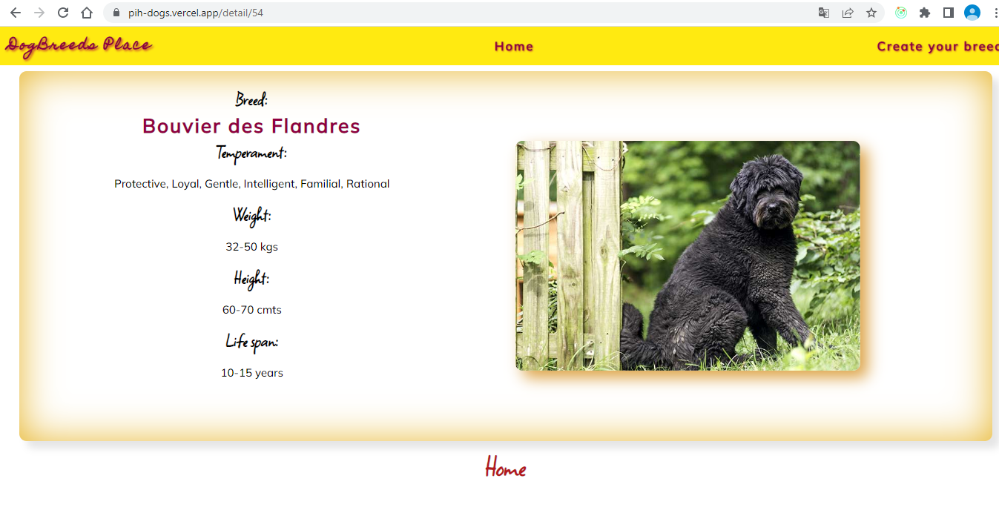
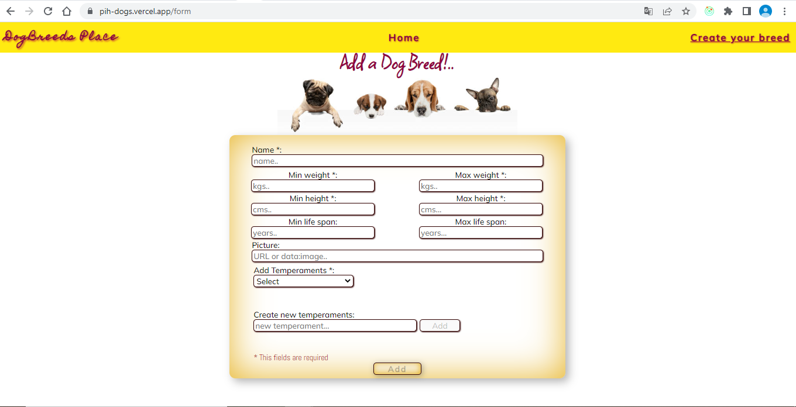

# Individual Project - Henry Dogs


## Project Objectives

- Build an App using React, Redux, Node, Postgres and Sequelize
- Using external libraries to apply styles to the application was not allowed, so CSS Modules was applied.

## Functionality

Application in which different breeds of dog can be seen along with relevant information about them, using the external api [the dog api](https://thedogapi.com/). This allows to:

- Search dogs
- Filter / Sort them (in front-end)
- Add new dogs that are stored in a database (the creation form is validated with JavaScript)

## Visit the web site here

https://pih-dogs.vercel.app

<div align="center">




</div>

## Quick start to run code

- Clone repository
- The boilerplate has two folders: `api` and `client`. In these folders will be the back-end and front-end code respectively. In `api` create a file called: `.env` that has the following form:

```send
DB_USER=postgresuser
DB_PASSWORD=postgrespassword
DB_HOST=localhost
```

- Replace `postgresuser` and `postgrespassword` with your own credentials to connect to postgres.
- Create a database called `dogs` from psql.
- Run npm install in both `api` and `client`.
- Run npm start in both `api` and `client`.
